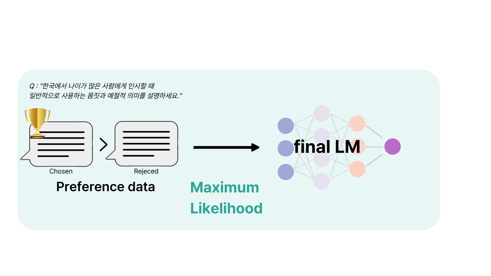

# KOREANQA 
> 2025년 국립국어원 AI말평 경진대회 프로젝트로 수행한 작업물입니다.

```
이 리포지토리는 한국어 어문 규범 준수를 위한 RAG 기반 생성 모델 시스템 구축 workspace 입니다. 
```

## Datasets

본 연구는 「한국어 어문 규범 기반 생성(RAG)」 과제에서 제공한 공식 데이터셋을 사용하였습니다.

- **총 1,247개 샘플**
  - Train: 622  
  - Validation: 127  
  - Test: 498
- **문항 유형**
  - 선다형, 단답형, 서술형, 교정형, 선택형
- **외부 기반 지식(RAG 문서)**
  - 국립국어원 PDF 문헌  
    - 「한글 맞춤법」, 「표준어 규정」,「문장 부호 규정」등


규범 문헌은 조항 단위로 분할·전처리 후, 임베딩 및 FAISS 인덱스를 구축하여 검색에 활용합니다.

##  Computing Environment & Hyperparameters

| Category       | Settings                                           |
|---------------|----------------------------------------------------|
| CPU           | Intel i9-10900X                                    |
| GPU           | NVIDIA GeForce RTX 3090                            |
| OS            | Ubuntu 22.04                                       |
| LoRA Rank     | 128                                                |
| LoRA Alpha    | 256                                                |
| Epoch         | 5                                                  |
| Learning Rate | 2e-5                                               |
| Batch Size    | 1                                                  |
| Target modules| q_proj, k_proj, v_proj, o_proj, gate_proj, up_proj, down_proj |
| Optimizer     | AdamW                                              |
| Scheduler     | Cosine decay                                       |

---

## 5. Experimental Results

<p align="center">
  
</p
  
### 5.1 Baseline vs 제안 모델

| Models        | Exact Match | BLEURT | BERTScore | ROUGE-1 |
|--------------|------------:|-------:|----------:|--------:|
| Baseline     | 53.92       | 54.72  | 72.92     | 45.53   |
| Our  | **66.86**   | **61.53** | **80.06** | **46.26** |

- Exact Match: **+12.94p**
- BLEURT: **+6.81p**
- BERTScore: **+7.14p**
  
---

### 5.2 CoT vs DPO (추가 비교 실험)

| Method | Exact Match | BLEURT | BERTScore | ROUGE-1 |
|--------|------------:|-------:|----------:|--------:|
| CoT    | **65.66**   | 55.12  | 71.75     | 34.83   |
| DPO    | 65.26       | **55.88** | **78.22** | **40.82** |

#### Preference Pair Generation Strategy

DPO 학습에서는 `(chosen, rejected)` 형태의 **선호 쌍(preference pair)** 을 다음과 같이 구성한다.

1. **Answer Embedding**  
   - 기준 정답(gold answer)을 문장 임베딩으로 변환한다.

2. **Similarity Search**  
   - 정답 임베딩을 쿼리로 사용해 의미적으로 **유사한 응답 후보**를 검색한다.

3. **Rejected Sample Generation**  
   - 유사하지만 규범 오류가 있거나 덜 선호되는 후보를 **rejected**로 구성한다.

<p align="center">
  
</p
---

## My Contributions

- **System Design**
  - 전체 파이프라인 설계

- **Object Detection Training**
  - 생활도로 객체인식 데이터셋 기반 YOLOv11s 학습 진행

- **VLM Fine-tuning & Evaluation**
  - Qwen2-VL-7B-Instruct 4bit 기반 VLM 학습 진행

- **Web Demo Implementation**
  - 데모 UI 구현 및 Backend 구축

---

## Achievements & Awards
-  **AI 말평 경진대회 5위 수상**  
-  **2025 한국정보기술과학회 논문 게재**  
  
